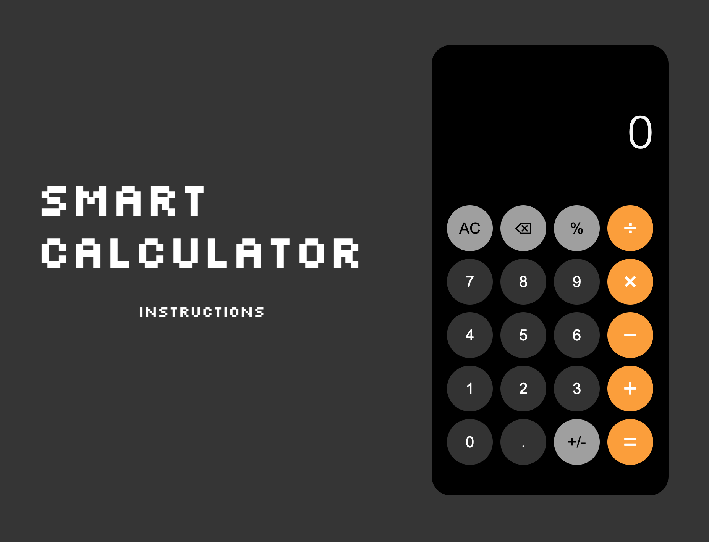

# Smart Calculator


A calculator that keeps track of previous calculations and allows users to reuse them.

## Description

It's a web app with a calculator interface. A user can either click the buttons shown on the interface or use the appropriate keys on the keyboard to carry out simple arithmetic operations. Every calculation will be shown on the side. By clicking one, the interface will show that arithmetic and the user can alter that to perform a new calculation.

## Getting Started

### Dependencies

- Node Package Manager
- React

### Installing

Download the app anywhere on your computer.

### Executing program

Use the commandline below in the location where the app is downloaded.

```
npm start
```

## Authors

Jay Lee
GitHub: [jyl7094](https://github.com/jyl7094)
LinkedIn: [jayleeswe](https://www.linkedin.com/in/jayleeswe/s)
